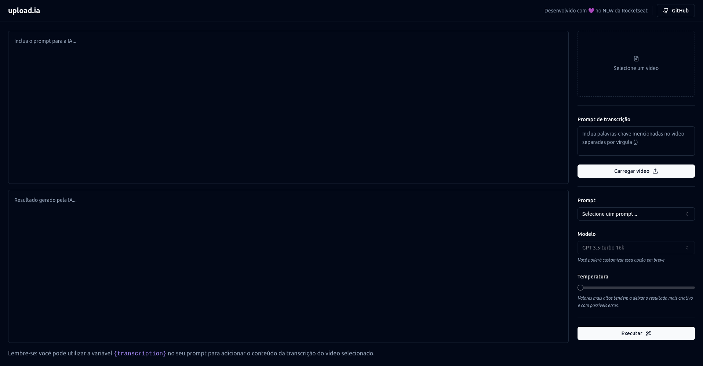

# upload.ia

Projeto desenvolvido na NLW IA da Rockeseat, que gera descrições ou títulos para vídeos do YouTube por exemplo, usando IA a partir do seu vídeo.


## Demonstração



## Stack utilizada

**Front-end:** React, Shadcn/ui, TailwindCSS, Vite

## Rodando localmente

Clone o projeto

```bash
  git clone https://github.com/andreyaraujo-dev/nlw-ia-web
```

Entre no diretório do projeto

```bash
  cd nlw-ia-web
```

Instale as dependências

```bash
  npm install
```

ou usando yarn

```bash
  yarn
```

Inicie a aplicação

```bash
  yarn dev
```
